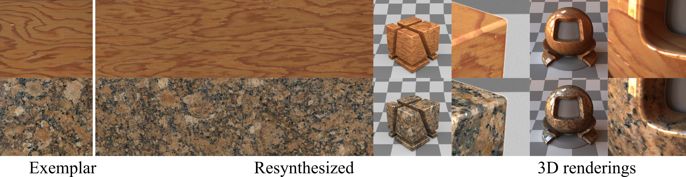

# GramGAN: Deep 3D Texture Synthesis From 2D Exemplars

This repository is the official implementation of [GramGAN: Deep 3D Texture Synthesis From 2D Exemplars](https://arxiv.org/abs/2006.16112). 



## Requirements

* python (2.7/3.7 tested)
* tensorflow
* python-opencv
* scipy

## Training

To train the model, run this command:

```train
python train_single.py --training_exemplar <path_to_exemplar>
```

## Evaluation

To evaluate the model, run:

```eval
python inference_single.py --model_name <path_to_chpt> --out_path <path_to_output_directory>
```
